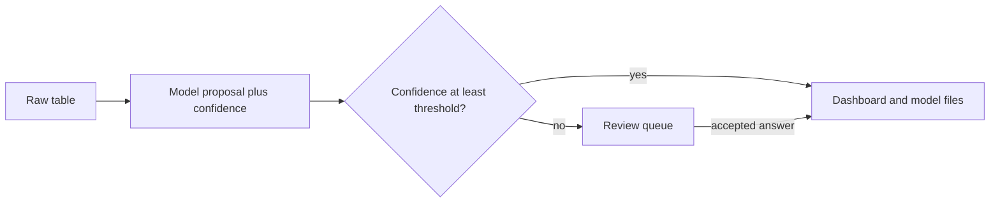

# Standardized pipeline

This folder turns a raw, messy table into two files that share one schema:

- `dashboard.csv` — cleaned columns for a dashboard
- `ml_features.csv` — the same rows, plus a missing flag for every column, described by `ml_schema.json`

A model proposes a value and a confidence score for every decision it makes. The confidence gate then decides who finishes the work.

| Confidence | Who finishes the decision | What is written to the dashboard and model files |
|---|---|---|
| Greater than or equal to the threshold (default **0.80**) | The model | The proposed value |
| Below the threshold | A person | Nothing yet. The proposal stays in `review_queue.csv` |

A row with a required field still waiting for a person is held out of both exports. Optional fields that are waiting are left blank, and the rest of the row can still be published.



## Layout

| Path | Purpose |
|---|---|
| `standardized_pipeline/` | Pipeline package |
| `../Winter26/sample_data/AIPHAS_raw_data_2026-2.csv` | Raw lab extract the pipeline ingests |
| `examples/target_schema.json` | Columns for that extract |
| `examples/messy_labs.csv` | Six-row file used to demonstrate the confidence gate |
| `examples/demo_schema.json` | Schema for that six-row file |
| `tests/` | Gate and end-to-end checks |

The target schema is the contract. Change it when the dashboard or the model needs a different table. Each column has a role (`id`, `categorical`, `numeric`, `datetime`, `text`), a required flag, source header names, and an optional vocabulary.

## Run

From this folder:

```bash
python3 -m standardized_pipeline run \
  --input ../Winter26/sample_data/AIPHAS_raw_data_2026-2.csv \
  --schema examples/target_schema.json \
  --output-dir output \
  --threshold 0.80 \
  --llm offline
```

Those three paths are the defaults, so `python3 -m standardized_pipeline run --llm offline` reads the same file.

`--llm auto` calls a local Ollama model when `http://127.0.0.1:11434` is up, and otherwise uses the offline model. The offline model returns the same kind of proposal as a live model, with fixed scores, so the gate can be reviewed without a server.

Each step is printed as it finishes, and the same line is flushed to `output/events.jsonl`. Add `--live` to open a page that follows those steps while the run is going:

```bash
python3 -m standardized_pipeline run \
  --input ../Winter26/sample_data/AIPHAS_raw_data_2026-2.csv \
  --schema examples/target_schema.json \
  --output-dir output \
  --threshold 0.80 \
  --llm offline \
  --live
```

The page highlights the active step (`schema`, `ingest`, `map_column`, `standardize_value`, `assemble`, `export`, `human`), lists every decision with its confidence and route, and updates row status as rows become ready or held. It stays up after the run until you press Ctrl+C. To attach the same page to a folder that is already being written:

```bash
python3 -m standardized_pipeline watch --output-dir output
```

`apply-reviews --live` appends the human step, then the new assemble and export steps, to the same log.

```bash
python3 -m unittest discover -s tests
```

## What the model decides

1. **Column mapping.** A header that matches a source name in the schema is accepted as a rule, with confidence 1. A header that does not match is sent to the model. On the lab extract, `_id`, `ordercode`, `specimen`, `item`, `unit`, `hospital`, `ref`, and `Date` all match. On the six-row demo file, `result note` is proposed as `note` at 0.55, so it waits for a person and is not added to the exports yet.
2. **Value standardization.** A value that already matches the vocabulary, a known date format, or a plain number is accepted as a rule, with confidence 1. Anything else is a model decision. The model must return:

```json
{"proposed_value": "urine", "confidence": 0.88, "rationale": "short reason"}
```

Confidence may be reported from 0 to 1, or from 0 to 100. A proposal that falls outside the schema vocabulary, a target column, or a required field is forced to confidence 0 and sent to a person, even if the model reported a high score.

The lab extract keeps `item`, `unit`, and `ref` as cleaned text. `specimen` still goes through the gate: `Urine` and `Blood` match the vocabulary and are completed by a rule, `血液` and `尿液` are completed by the model, and `血` at 0.61 waits for a person, which holds that row. A blank specimen is required, so that row waits too.

On `examples/messy_labs.csv` with `examples/demo_schema.json` at threshold 0.80, the offline model publishes four rows and holds two:

- `urin` → `urine` at 0.88, completed by the model
- `血` → `blood` at 0.61, left for a person, so that row is held
- `2024/13/40` cannot be parsed; the date is optional, so the row is published with a blank date and the bad value stays in the review queue
- a row with a blank order code and unknown specimen, test, and unit is held

## Human review

Open `output/review_queue.csv`. Decisions are unfinished model predictions. Fill a response file:

```csv
decision_id,accepted_value
<id from the queue>,blood
```

For a column-mapping decision, `accepted_value` is a target column name, or `DROP`. For a value decision, it must be allowed by the schema. Then rebuild the exports:

```bash
python3 -m standardized_pipeline apply-reviews \
  --output-dir output \
  --responses responses.csv \
  --llm offline
```

The person's answer is stored as `completed_by_human`. The original model confidence is kept in `decisions.jsonl` so the audit trail still shows why the model did not finish that decision. If the person confirms a column that was waiting, values in that column are standardized and pass through the same gate.

## Outputs

| File | Contents |
|---|---|
| `dashboard.csv` | Ready rows only, one column per schema field |
| `ml_features.csv` | Those same rows, with `<column>__missing` set to 1 or 0 |
| `ml_schema.json` | Types and vocabularies for any trainer or dashboard |
| `review_queue.csv` | Decisions below the threshold |
| `held_rows.csv` | Rows blocked by a required field that is still waiting |
| `column_map.csv` | How each raw header was assigned |
| `decisions.jsonl` | Every decision, score, route, and accepted value |
| `events.jsonl` | One flushed line per step, used by the live page |
| `manifest.json` | Row counts and the threshold used for the run |
| `state.json` | Saved inputs and decisions, used by `apply-reviews` |
